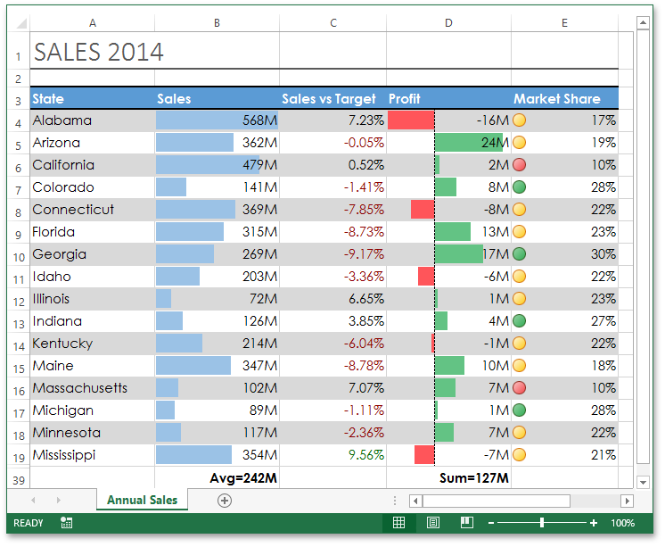

<!-- default badges list -->

<!-- default badges end -->

# Excel Export API - Perform a Sales Analysis

This example demonstrates how to use the [Excel Export Library](https://docs.devexpress.com/OfficeFileAPI/114031/excel-export-library) to generate the "Sales Analysis" document shown in the image below.

In particular, this example introduces API properties and methods used to perform the following operations:

- Create a new workbook
- Create and rename a worksheet
- Create columns and rows, and adjust the column width and row height
- Create cells and set their values
- Format cells (set the cell font, background color, alignment, borders, number format, etc.)
- Specify print options (define the print area and adjust page settings)
- Create a data bar conditional formatting rule
- Create an icon set conditional formatting rule
- Create a rule that formats top or bottom ranked values
- Create a rule that formats cells whose values meet the condition expressed by the relational operator
- Use formulas to calculate subtotals

## Files to Review

* [Form1.cs](./CS/XLExportExample/Form1.cs) (VB: [Form1.vb](./VB/XLExportExample/Form1.vb))
* [SalesData.cs](./CS/XLExportExample/SalesData.cs) (VB: [SalesData.vb](./VB/XLExportExample/SalesData.vb))
<!-- feedback -->
## Does this example address your development requirements/objectives?

 

(you will be redirected to DevExpress.com to submit your response)
<!-- feedback end -->
